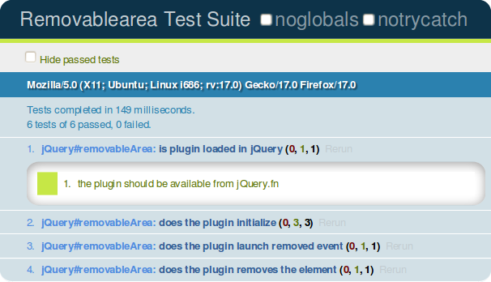
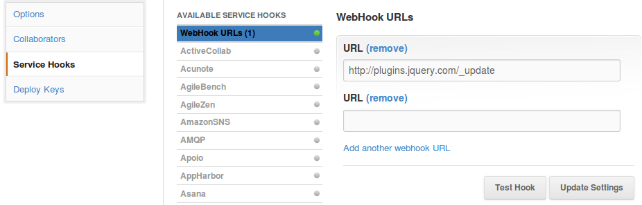

While I was developping the user interface of a pet project, this though came to my mind : _"Thoses components you're doing, why don't you create pure jQuery plugin, you know?"_. Then starts the story: I've created a Github repository, looked for tools, built one plugin, then another, doing a conference at work and now a blog post.

<!-- more -->

The big picture: I'm used to use HTML, CSS et the jQuery library as well as his best companion jQuery-UI to develop the user interfaces of my webapps. Since I started, I've evolved from creating everything in the same script, then use jQuery plugins to making self contained libraries.

In this post, I'll try to _pluginify_ step by step, a small component used to delete an element of the graphical interface.

## Environnement

First, you'll need:

* An operating system with a Bash like shell (bash, ksh or zsh are fine), for the others you'll need to find an alternative like Cygwin or similar.
* Have the root/admin permission on the system.
* Git installed (optional, but it'll help you to get the source code on Github).
* A texte editor.

For the need of this post, I've used Ubuntu 12.04, Precise Pangolin.

### Node.js & NPM

> But wait, what is the link between jQuery and Node.js? Not sure to follow you.

We need [node.js](http://nodejs.org), to install our build system. There is a lot of JavaScript libraries in CLI that rely on node.js. And, the packaging system that comes with node.js, [npm](http://npmjs.org) is really nice and will help to install those libraries. 
----HERE------
Par ailleurs, quand on développe en Javascript, même pour du développement client, c'est une bonne chose d'avoir node.js installé, car on peut profiter de tout un tas d'outils sympa.

Pour installer node.js et npm sous Debian/Ubuntu:

``` bash
$> sudo aptitude install nodejs npm
```

Pour les autres, vous pouvez vous reporter au site de [node.js](http://nodejs.org/download/)

### Grunt


Une fois la commande npm disponible, il va falloir installer [Grunt](http://gruntjs.com), l'outils que nous utiliserons pour automatiser les tâches de build de notre plugin. Nous allons donc l'installer avec npm, en mode _global_ (donc accessible pour tous les utilisateurs), d'où le commutateur <code class='inline'>g</code>. C'est pourquoi il faut l'installer avec les droits root.

``` bash
$> sudo npm install -g grunt
```

### Phantom.js


Le dernier outils a installer sur votre système est [Phantom.js](http://phantomjs.org), qui va nous servir pour simuler un browser durant nos tests. Il est aussi disponible depuis le gestionnaire de paquet sur les distributions récentes:

``` bash
$> sudo aptitude install phantomjs
```

ou en le téléchargeant depuis le [site web](http://phantomjs.org/download.html), dans ce cas, ne pas oublier de le rajouter dans le <code class='inline'>PATH</code>.

## Les choses sérieuses

Voici un exemple de code intégré à un script d'une application:



Cet exemple est utilisé pour créer une liste HTML en fonction du résultat d'une requête Ajax. Chaque item de la liste doit pouvoir être supprimé par la suite. C'est ce point qui nous intéresse, car nous voulons pouvoir appliquer ce composant de suppression à d'autres parties de notre interface graphique. 

Nous allons procéder en suivant ces étapes:

1. Trouver un nom au plugin.
2. Générer une structure, un archétype pour notre plugin.
3. Refactorer notre code au sein d'un plugin.
4. Créer une page d'exemple dédié.
5. Créer un ensemble de tests unitaires.
6. Définir notre séquence de build.
7. L'indexer le site des plugin jQuery.

## Trouver un nom qui déchire

Alors, voici ma _bête noire_ de la programmation: trouver des noms aux variables, classes, projets! Je n'ai pas ce côté inventif qui va permettre de trouver le nom d'animal super cool, donc je reste très terre à terre. Notre plugin s'appellera *RemoveableArea*! super... :-(. Si quelqu'un à une meilleure idée, je suis preneur.

> Ca c'est fait.

## Générer la structure du projet

L'avantage d'utiliser un outil tel que Grunt c'est qu'il fait une part de notre travail, donc quand on est fainéant, on ne peut plus s'en passer. 
Grunt dispose d'une tâche <code class='inline'>init</code> qui permet de générer une structure de projet type en partant d'un template. Et ça tombe bien, il y en a un pour jQuery.

Dans l'ordre, on va:
1. Créer un répertoire pour notre plugin.
2. Le versionner avec GIT.
3. Générer la structure de base.


``` bash
$ mkdir removablearea
$ cd removablearea
$ git init
Initialized empty Git repository in /home/bertrand/dev/workspace/removablearea/.git/
$ grunt init:jquery
#answer the questions about the plugin
#...
Initialized from template "jquery".
Done, without errors.
$ git add -A
$ git commit -m "Create base plugin"
```

Voilà, maintenant, notre structure est générée, le projet est versionné avec GIT, et si vous avez renseigné soigneusement les questions demandées par Grunt, alors un certain nombre de sections sont déjà pré-remplies.

Normalement, vous devriez avoir l'arborescence suivante:
<pre>
.
├── grunt.js					//fichier de build
├── libs						//librairies externes
│   ├── jquery
│   │   └── jquery.js
│   ├── jquery-loader.js
│   └── qunit
│       ├── qunit.css
│       └── qunit.js
├── LICENSE-GPL					//licenses
├── LICENSE-MIT
├── package.json				//meta données du projet
├── README.md					
├── removablearea.jquery.json	//meta données du plugin
├── src							//sources du plugin
│   └── removablearea.js
└── test						//tests unitaires
    ├── removablearea.html
    └── removablearea_test.js
</pre>

Nous allons modifier un peu cette structure, en y ajoutant un répertoire <span class="inline-code">sample</span> dans lequel nous allons créer des exemples d'utilisation de notre plugin.

## Pluginification

Dans un premier temps, nous allons créer la structure (au sens du typage en programmation) de notre plugin jQuery, en se basant sur les bonnes pratiques détaillée dans la [documentation jQuery](http://docs.jquery.com/Plugins/Authoring "jQuery Plugin AUthoring") à ce propos. Nous allons donc utiliser la structure suivante, comme base de notre fichier <span class="inline-code">src/removablearea.js</span>:



Tout d'abord, on peut remarquer que le code est englobé dans une closure. Ce pattern s'appelle _Immediately-Invoked Function Expression_ (ou _LIFE_). Cette pratique permet d'éviter d'exécuter du code dans le scope global. Dans le cas de jQuery, cet usage permet d'utiliser le symbole dollar en étant sûr qu'il vient de jQuery et non d'un autre framework, le <span class="inline-code">$</span> est mappé à l'objet <span class="inline-code">jQuery</span> :


``` javascript
(function( $ ) {
	//your code
})( jQuery );
```

Un autre point que l'on peut souligner est ce string utilisé à la ligne 2:


``` javascript
	"use strict";
```

La présence de ce string permet de passer le moteur Javascript en mode _strict_, qui le rend moins tolérant à certaines pratiques du langage. Vous pouvez consulter la [documentation Mozilla](https://developer.mozilla.org/en-US/docs/JavaScript/Reference/Functions_and_function_scope/Strict_mode) pour plus de détails sur ce mode.

Ensuite la partie qui permet de créer le plugin jQuery peut se résumer à cette ligne:


``` javascript
    $.fn.removableArea = function( method ) { }
```

Littéralement, nous ajoutons à l'attribut <code class='inline'>fn</code> de l'objet <code class='inline'>jQuery</code> (ou <code class='inline'>$</code> pour les intimes), la fonction <code class='inline'>removableArea</code> qui prend en paramètre un nom de méthode. C'est grâce à cette ligne que nous pourrons appeler la fonction <code class='inline'>removableArea</code> sur un élément du DOM, comme <code class='inline'>$('.boo > #far').removableArea(options);</code>.

Ensuite le contenu de cette fonction va tout simplement déléguer les appels à l'objet <code class='inline'>RemovableArea</code> définit au préalable, en fonction du contexte d'appel:

- <code class='inline'>removableArea</code> est appelé avec un objet en paramètre (les options): 
  - On délègue à <code class='inline'>RemovableArea.init(options)</code>.
- <code class='inline'>removableArea</code> est appelé avec un string en paramètre:
  - Ce string correspond à une méthode de <code class='inline'>RemovableArea</code>, alors on délègue, sauf si ce nom commence par un _underscore_ (genre de méthode privée).
- <code class='inline'>removableArea</code> est appelé sans paramètre, on lève une erreur.

Grâce à ce mécanisme de paramètres, nous pouvons appeler des méthodes à partir du même plugin: 

``` javascript
    var elt = $('#id').removableArea(options);
    elt.removableArea('destroy');
```

## Refactoring

Maintenant, que nous avons la structure de notre plugin en place, nous allons y intégrer notre code. Pour cela, il faut se poser les questions suivantes:

- Quelles sont les options demander à l'utilisateur et quelles seront les valeurs par défaut ?
- Comment répartir notre code entre la méthode par défaut (<code class='inline'>RemovableArea.init(options)</code>) et d'autres méthodes ?
- Quels événements déclencher pour aider à l'implémentation du plugin ?

### Les options

Par convention, le paramétrage des plugins se fait en passant un objet contenant les options pour initialiser le plugin. Le code suivant va permettre d'initialiser le composant de notre exemple:


``` javascript
$.removableArea({
	label 		: 'Supprimer',
	img 		: '/imgs/delete.png',
	warning 	: 'Voulez-vous supprimer cet élément?',
	hoverClass 	: 'half-opac'
});
```

Nous avons donc définis un certain nombre de paramètres, comme l'image du _bouton_ qui s'affichera pour supprimer la zone ou les différents labels. On permet aussi de définir la classe CSS qui s'appliquera sur ce _bouton_ au passage de la souris. 
 
### Les paramètres par défaut

Une fois le liste des options définies, il faut leur donner des valeurs par défaut. Cela permet d'éviter de redonner toutes les options à chaque utilisation, et permet surtout de mettre en place un comportement par défaut. L'idée est que le plugin fonctionne tout de suite, mais de laisser la possibilité de le modifier plus tard.

Pour faire cela, nous allons utiliser un méthode de jQuery qui est très utile: <code class='inline'>$.extend</code> qui permet de _merger_ les options passées en paramètres et les options par défaut.

Nous allons donc définir ces paramètres par défaut dans un attribut de notre objet <code class='inline'>RemovableArea</code>, puis les étendre avec les paramètres passés au plugin:


``` javascript
	var RemovableArea = {
        _opts : {
            label : 'Supprimer',
            img : '/imgs/delete.png',
            warning : 'Voulez-vous supprimer cet élément?',
            hoverClass : 'half-opac'
        },
		_init: function(options){
			var opts = $.extend(true, {}, RemovableArea._opts, options);
			//...

		}
	};
```

Grâce au résultat de la méthode <code class='inline'>$.extend</code> la variable <code class='inline'>opts</code> contient les options passées par l'utilisateur ou leur valeur par défaut s'ils ont été omis.

###Le code du plugin

Maintenant, que nous avons une structure à notre plugin, la gestion des paramètres et options, il va falloir répartir le code entre la méthode d'initialisation et d'autres méthodes que nous rajoutons en fonction du fonctionnement souhaité. L'approche que je met souvent en place est de tout faire dans un premier temps dans la méthode d'initialisation, puis je refactor au fur et à mesure (le problème est qu'il m'arrive de n'avoir jamais le temps de refactorer...). 

Pour notre exemple, nous allons créer les éléments du DOM dans la méthode d'initialisation et une méthode <code class='inline'>destroy</code> pour supprime tout ce que le plugin a créé. 



Voilà donc notre plugin créé! On peut aussi noter l'ajout de deux événements : le premier étant déclenché à l'initialisation du plugin et le second lors de la suppression. Le nom des événements est suffixé par _removablearea_, qui est une manière de les grouper dans des [namespaces](http://docs.jquery.com/Namespaced_Events).

## Mise en oeuvre : créer une page d'exemple

Bon rien de bien compliqué ici, je créé juste une page HTML basique qui charge jQuery et notre plugin. Le principe est d'avoir un cas d'utilisation classique du plugin.
Pour notre plugin, je créé cette page dans le répertoire <code class='inline'>sample</code> et je la publie avec [Github-Pages](http://pages.github.com/) (ce qui est bien pratique). Jetez donc un oeil à cet [exemple](http://krampstudio.com/jQueryRemovableArea/index.html) et aux sources <code class='inline'>Ctrl-U</code>.

## Tester du Javascript

> Tester c'est douter :-S

On voit trop rarement des tests mis en place pour le code Javascript, mais pourtant tous les outils dont nous avons besoin sont disponibles (il y a en a même pas mal!). Donc comme pour n'importe quel autre langage, nous allons créer des tests unitaires automatisés pour notre plugin. 


Parmi les nombreux frameworks existant, mon dévolu c'est posé sur [Qunit](http://www.qunitjs.org) car c'est le framework de tests de jQuery d'une part (donc il s'intègre naturellement avec un plugin jQuery) et d'autre part parce qu'il offre toutes les fonctionnalités dont nous avons besoin: tests asynchrones, _fixtures_, groupes, etc.

Le test se compose de deux fichiers:

* Un fichier HTML, qui contient:
  * Une structure de base à ne pas modifier
  * Un bloc _fixtures_ dont l'identifiant est <code class='inline'>qunit-fixture</code>. C'est dans ce bloc uniquement que nous pouvons inclure nos éléments liés à notre test. Le contenu de ce bloc n'est pas visible et sera rechargé après l'exécution de chaque méthode de test.
* Un fichier Javascript qui va contenir notre test.

Du point de vue de l'API de test, Qunit nous propose:

* D'organiser les tests en modules. Les tests peuvent partager des attributs lorsqu'ils sont groupés en module.
* Un ensemble de fonctions comparables à des assertions, comme <code class='inline'>ok( boolean )</code>, <code class='inline'>equal(expected, compared)</code>, etc.
* Des méthodes pour tester des méthodes asynchrones.

Testons notre plugin!

Tout d'abord, nous créons dans les _fixtures_ trois blocs qui vont nous servir comme zones de suppression:


``` markup
	<div id="qunit-fixture">
		<div>lame test markup</div>
		<div>normal test markup</div>
		<div>awesome test markup</div>
	</div>
```

Ensuite, nous définissons un module dans le test. L'ordre d'invocation des méthodes est important, car toutes les méthodes de test définies après la déclaration du module feront parties de ce module. Ce module va aussi se charger d'initialiser l'attribut <code class='inline'>targets</code> que nous faisons pointer sur les zones à supprimer, et nous pourrons utiliser cet attributs dans tous les tests du module.


``` javascript
	module('jQuery#removableArea', {
		setup: function() {
			this.targets = $('#qunit-fixture').children();
		}
	});
```

Puis nous déclarons une méthode de test classique qui s'assure que le plugin est bien chargé par jQuery:


``` javascript
	test('is plugin loaded in jQuery', 1, function(){
        ok( (typeof $.fn.removableArea === 'function'), "the plugin should be available from jQuery.fn");
    });
```

Ensuite, un petit test asynchrone qui se déroule en 3 temps:

1. Déclaration d'un <code class='inline'>asyncTest</code>.
2. Définir le nombre d'assertion attendues via la fonction <code class='inline'>expected</code>.
3. Appeler la fonction <code class='inline'>start</code> une fois que le code asynchrone a été exécuté.

Ce qui donne le test suivant, qui vérifie que le plugin a bien été chargé en écoutant l'événement d'initialisation:


``` javascript
    asyncTest("does the plugin initialize", function(){

        expect(this.targets.length); 	//we expect 3 assertions, one by target

        this.targets.bind('init.removablearea', function(){
                strictEqual(1, $('.removable-ctrl', this).length);
                start();
            });
        this.targets.removableArea();
    });
```

Pour lancer les tests, il suffit de charger la page HTML. Le résultat est visible depuis celle-ci, comme nous pouvons le voir sur la capture suivante: 



## Automatisation

> Un makefile pour du Javascript ?
>> C'est un peu l'idée oui!

Dans le but d'améliorer la qualité de nos développements et de gagner du temps, nous allons déléguer les tâches suivantes à un outils de build, [Grunt](http://www.gruntjs.org) dont nous avons déjà parlé précédemment: 

* Minimification des sources.
* Ajout de la bannière de licence.
* Exécution des tests.
* Vérification du code.

Pour faire tout cela, c'est simple nous utilisons les plugins fournis de base avec Grunt.

### Génération des sources finales

Nous allons distribuer notre plugin sous forme minimifié, mais avec tout de même une bannière rappelant les informations essentielles: le copyright, l'auteur et la licence. Ces informations vont être extraites et formatées à partir du fichier de méta-données : <code class='inline'>package.json</code>. Ce fichier est bien sûr formaté en JSON et suit la convention de description de paquet [NPM](http://www.npmjs.org) (les paquets node.js). Vous pouvez allez voir la [spécification](https://npmjs.org/doc/json.html) pour plus de détails. 

Dans le cas de notre plugin, les méta-données sont les suivantes:

 

Maintenant nous souhaitons avoir en entête de nos sources le commentaire suivant:


``` javascript
/**
 * Copyright (c) 2012 Bertrand Chevrier
 * jQueryRemovableArea - v0.1.0 
 * @author Bertrand Chevrier <chevrier.bertrand@gmail.com>
 * @license GPL  <http://www.gnu.org/licenses/gpl-3.0.txt>
 */
```

Pour cela Grunt nous propose un mécanisme qui va nous permettre de récupérer le contenu du fichier <code class='inline'>package.json</code> et de l'utiliser au sein de notre fichier de build, via un mécanisme de template basique. De plus, Grunt a mis en place le concept de <code class='inline'>banner</code> qui pourra être concaténé avec notre fichier source. 

Voici le fichier de build <code class='inline'>grunt.js</code> qui va minimifier les sources et créer l'entête:


``` javascript
	grunt.initConfig({
        pkg: '<json:package.json>',
        meta: {
            banner: '/**\n'+
                    ' * Copyright (c) <%= grunt.template.today("yyyy") %> <%= pkg.author.name %>\n' +
                    ' * <%= pkg.name %> - v<%= pkg.version %> \n' +
                    ' * @author <%= pkg.author.name %> <<%= pkg.author.email %>>\n' +
                    ' * @license <%= pkg.licenses[0].type %>  <<%= pkg.licenses[0].url %>>\n'+
                    ' */'
        },
        min : {
            dist : {
                src: 'src/removablearea.js',
                dest: 'jquery.removablearea.min.js'
            }
        },
        concat : {
            dist : {
                src : [ '<banner>', 'jquery.removablearea.min.js'],
                dest: 'jquery.removablearea.min.js'
            }
        }
	});
```

La commande :

``` bash
$> grunt min concat
```

va produire notre fichier final <code class='inline'>jquery.removablearea.min.js</code>.

### Tests et vérification

Nous pouvons automatiser l'exécution des tests Qunit avec Grunt et PhantomJs. PhantomJs permet d'exécuter le test dans un navigateur en ligne de commande: il créé un navigateur de type WebKit en _headless_. 

Pour la vérification du code source, nous utilisons [JSHint](http://www.jshint.com) qui est plus flexible que [JSLint](http://www.jslint.com). 

Puisque nous utilisons les plugins fournis par défaut avec Grunt, la configuration se résume à l'ajout d'un pattern pointant sur les fichiers de tests Qunit et la définition des règles JSHint. 

Le fichier de build final ressemble à cela:



Et voici le genre de sortie que devrait retourner Grunt si tout se passe bien durant le build:

``` bash
$> grunt 
Running "lint:files" (lint) task
Lint free.

Running "qunit:all" (qunit) task
Testing removablearea.html....OK
>> 6 assertions passed (61ms)

Running "min:dist" (min) task
File "jquery.removablearea.min.js" created.
Uncompressed size: 2001 bytes.
Compressed size: 660 bytes gzipped (1269 bytes minified).

Running "concat:dist" (concat) task
File "jquery.removablearea.min.js" created.

Done, without errors.
```

## Partager 

> On va rentrer dans la postérité

Bien que le [site](http://plugins.jquery.com/) répertoriant les plugins JQuery soit *en cours de développement*, il nous donne déjà la procédure à suivre pour y inscrire notre plugin. Dès que le site sera fini, notre plugin devrait théoriquement parti de la liste, un très bon moyen pour le faire connaître et de le partager. 

### Les méta-données 

Tout comme pour le build, nous devons créer un fichier qui va contenir les informations relatives à notre plugin. Ce fichier servira à fournir les informations nécessaires pour indexer le plugin. Ce fichier est très proche du fichier <code class='inline'>package.json</code> (car ils se sont inspirés de la spec NPM), mais trop différent pour n'utiliser qu'un seul fichier... En suivant le [format spécifié](https://github.com/jquery/plugins.jquery.com/blob/master/docs/manifest.md), voici à quoi ressemble ce fichier pour notre plugin:



Bon, c'est un peu redondant avec le fichier <code class='inline'>package.json</code> et il est surement possible de le générer avec depuis celui-ci, d'ailleurs si quelqu'un le fait déjà n'hésitez pas à laisser un commentaire!

### Préparer l'indexation

Pour préparer l'indexation sur le site [plugins.jquery.com](http://plugins.jquery.com), il suffit d'ajouter un _hook_ sur notre dépôt Github, comme décrit le décrit cette [procédure](https://github.com/jquery/plugins.jquery.com#how-to-list-a-plugin). La capture suivante montre l'interface d'administration du projet sur Github qui permet de rajouter le hoot:



# Et voilà

> Un petit plugin jQuery aux petits oignons.

Le code source de l'exemple est bien entendu disponible sur mon Github [krampstudio/jQueryRemovableArea](https://github.com/krampstudio/jQueryRemovableArea). 

*Enjoy javascript coding*
