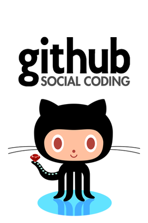
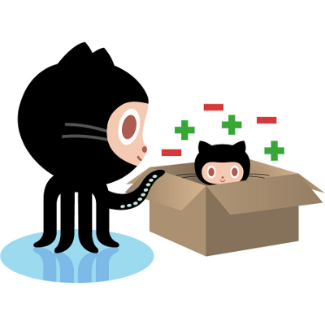

I've created my [Github account](https://github.com/krampstudio) the 5th of November 2010. Ce que je cherchais : seulement un hébergement pour mes dépôts GIT, voire une sorte de Sourforge. J'étais loin de me douter que ce service allait profondément modifier ma façon de développer. Après avoir été initié à GIT en 2008, je souhaitais juste pouvoir _backuper_ mes dépôts locaux et y accéder de partout. Je précise les dates, car à ce moment, je n'avais pas la moindre idée de ce qu'était vraiement Github et de ce qu'il allait devenir.

<!-- more -->

Effectivement, c'est beaucoup plus tard que je me suis rendu compte de tous les services sous-jacent et notamment du côté _social_ de Github: la facilité déconcertante avec laquelle on peut contribuer à un projet. Pas besoin de s'inscrire à une mailing list, de lire le manuel du contributeur pour soumettre un patch. Avec Github, le _fork_ et le _pull request_  encouragent grandement à la contribution. Un bug, une fonctionalité manquante à un projet, je fork et je modifie. Je souhaite reverser mes modifications à l'auteur je pull request. L'open source comme on l'avait rêvé. Il y a tout de même un question que je me pose fréquement: certains dépôts n'ont pas de licences, et dans ce cas, bien que le dépôt soit public, a-t-ont le droit de forker, de modifier et donc de redistribuer (je parle des dépôts publics) ? 

Aujourd'hui Github comme plusieurs millions d'utilisateurs et de dépôts! Le tout web utilise Github et bien plus. 

Dans mon cas, Github me sert à

 * Avoir un dépôt Git distant
 * Gérer la documentation de mes projets (wiki)
 * Gérer les tickets (iusses)
 * Contribuer à des projets tiers (fork et pull request)
 * Repackager sous Github des projets tiers
 * Héberger ce présent blog ainsi que les mini-sites de mes projets (GitHub pages)
 * Suivre des dépôts et des développeurs
 * Utiliser Github comme dépôt de packages 
 * Notification de services tiers (via les hooks)
 * Frounisseur d'authentification sur d'autres sites (via Oauth 2)

Et je suis sûr que je n'utilise pas tout...

** Dé Re centralier **

J'ai lu des postes de personnes se plaigant des récentes coupures du service. Ma première réaction a été de me demander quel était le problème, de me dire que certaines personnes n'avaient rien compris au mode décentralisé: on peut travailler sur notre dépôt local et pousser dès le service est _up_ à nouveau, au pire on ne peut pas mettre à jour ses _issues_. C'est le principe d'un outils décentralisé. Mais dernièrement, j'ai commencé à utiliser des services de dépôts de paquets construits autout de Github: [NPM](http://npmjs.org) pour les paquets node.js et [Bower](http://twitter.github.com/bower) pour les dépendances Javascript clientes. NPM a son propre [serveur de paquet](http://registry.npmjs.org), mais il est possible de faire pointer une dépendance directement sur un dépôt Github. Bower, lui, utilise Github comme source pour télécharger les dépendances, et là dès que Github est en maintenance, impossible d'installer la moindre dépendance. C'est plutôt embarrassant. J'aime beaucoup le principe du serveur de paquets, que j'utilise autant côté système (Debian) ou pour le développement (Maven) et à vrai dire je n'ai jamais eu le moindre soucis, peut être à cause du principe de serveurs mirroirs répartis autour du monde (en tout cas chez Debian). Peut être Github devrait faire la même chose, au moins pour limiter les dégâts en cas d'interruption de service. J'aime beaucoup Github, leurs services, leur société, leur vision, mais maintenant beaucoup de projets de dépendent très fortement d'eux et si un jour ca s'arrête quel seront les impacts? Heureusement qu'il ne s'agit pas de SvnHub ou CvsHub  
