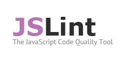

Javascript est devenu un langage à la mode. Une profusion d'outils et de librairies fleurissent chaque jour. Lorsqu'on commence un nouveau développement, plusieurs possibilités s'offrent à nous pour composer notre _stack_ côté client (et je ne parle pas du JavaScript côté serveur). Le but de ce post est de lister un certain nombre d'outils permettant de créer cette pile de librairies. 

Cette liste n'est pas exhaustive, car elle se base tout d'abord sur les outils que j'utilise, ai utilisé ou envie d'utiliser. Le nombre de librairies JavaScript de bonne qualité croit de jour en jour et il est difficile de suivre cette frénésie. Mais j'essaierai de mettre à jour cette liste au fil de l'eau... 

_N'hésitez pas à m'aider à la compléter._

<!-- more -->

## node.js

Node.js est une implémentation JavaScript côté serveur. Node.js utilise V8, le moteur JavaScript de Chromium/Chrome, et fournit des API de développement réseau basé sur un modèle de programmation événementiel et des I/O non bloquantes. 

> Mon nouvel amour

Site web : [nodejs.org](http://nodejs.org)

## npm

Npm (_Node Package Manager_) est le gestionnaire de paquets pour node.js. 

Même dans le cadre de développement client, avoir node.js sur votre machine vous permettra d'avoir à votre disposition beaucoup d'outils et de librairies distribuée sous forme de module node.js (build, qualité, instrumentation, optimisation, etc.). Grâce à npm, vous pourrez les installer et les mettre à jour très facilement. Par exemple, pour installer l'outils _uglify_ (qui permet notamment de minimiser les fichiers sources), il suffira de faire un petit `npm install -g uglify`. 

> On ne peut s'en passer

Site web : [npmjs.org](https://npmjs.org)

Licence : MIT

## jQuery

Est-il encore besoin de présenter jQuery? Au cas où vous sortez d'une longue hibernation, jQuery est le framework Javascript permettant de s'affranchir des différences entre navigateurs. Cette librairie de bas niveau permet notamment de récupérer des éléments du DOM en fonction de requêtes CSS (d'ailleurs cette seule fonctionnalité, extrêmement puissante a été externalisé dans un moteur à part: [Sizzle](#sizzle)), de manipuler le DOM et ces événements, de faire des requêtes Ajax. jQuery fournit aussi tout un tas d'outils qui facilite la vie du développeur Javascript. 

> Cette librairie est légère et largement répandue. Le slogan du projet  "_write less do more_" reflète bien ce qu'apporte ce framework. Ceux qui ont eu a manipuler le DOM sans ce genre de librairie peuvent évaluer jQuery à sa juste valeur.

Sites web : [jquery.com](http://jquery.com)

Licence : MIT

##  Sizzle

Sizzle est un projet qui a pour but de permettre de sélectionner un nœud du DOM en utilisant les sélecteurs CSS3. Sizzle est le moteur utilisé au sein de jQuery pour la partie sélection. 

> Sizzle est très utile dès lors que l'on souhaite faire des manipulations complexes (on peut facilement créer ses propres sélecteurs) ainsi que dans le cas où vous n'utilisez que la partie sélection de jQuery, cela vous permettra de n'inclure que l'essentiel notamment dans le cadre du développement d'une librairie.

Site web : [sizzlejs.com](http://sizzlejs.com)

Licence : MIT

## jQuery UI

jQuery UI est, comme son nom l'indique, une surcouche à jQuery dédiée aux composants graphiques. Cette librairie offre quelques composants prêt à l'emploi comme les sliders, les tabulations, date-pickers, etc. ainsi que des éléments plus basique pouvant servir à créer ses propres composants comme les effets, le _drag n'drop_, la gestion des positions, etc. 

jQuery UI utilise des thèmes pour ses composants, facilement customisables grâce à son éditeur de thème en ligne: le _theme roller_.

> jQuery UI est une librairie de très bonne qualité et dont il faut embrasser la philosophie: utiliser les composants disponibles comme des briques de bases pour votre UI, elle n'a pas vocation a proposer une pléthore de composants de haut niveau comme le fait par exemple ExtJS.

Site web : [jqueryui.com](http://jqueryui.com)

Licence : MIT

## QUnit

QUnit est un framework de tests unitaires JavaScript orienté client. Bien que développé initialement pour tester les différents projets de la fondation jQuery, c'est un framework de test généraliste facile à utiliser et qui s'adapte bien aux tests de code client. Il propose les fonctionnalités de bases comme les assertions, le regroupement des tests ainsi que des fonctionnalités plus avancées comme les tests asynchrones ou les fixtures (une sorte de mock HTML qui permet de réaliser le test avec des éléments externes du DOM dont le code JavaScript peut dépendre).

> QUnit est simple, efficace et rapide à mettre en œuvre. 

Site web : [qunitjs.com](http://qunitjs.com)

Licence : MIT

## jQuery Mobile

jQuery Mobile est un framework d'interface graphique orienté mobile. Il propose une solution complète de création d'une interface web adaptée aux appareils mobiles (smartphones et tablettes). Cette librairie ne nécessite que peu de code JavaScript et utilise plutôt une sémantique HTML5 qui permettra de définir les éléments d'interface. 

> jQuery Mobile est une des solutions mobile pour le web les plus facile à mettre en place. A noter tout de même des difficultés dès lors que l'on souhaite sortir du cadre définit.

Site web : [jquerymobile.com](http://jquerymobile.com)

Licence : MIT

## Choisir son moteur de template Javascript

Plutôt que de lister les différents moteurs de template en JavaScript, je vous renvoie vers ce [site](http://garann.github.com/template-chooser/) plutôt sympa qui permet de choisir son moteur de _gabarits_ en fonction de critères contextuels.

## Grunt

Grunt se définit comme un _task runner_, c'est donc un outils de _build_ au sens large qui vous permettra d'automatiser un certain nombre de tâches comme la minimification des fichiers, l'orchestration des tests ou la génération de la documentation. Chaque tâche se présente sous la forme d'un plugin et il est très facile de créer ces propres tâches bien qu'il en existe déjà un nombre important. Grunt est distribué sous la forme de packages [node.js](#node).

> Grunt est vraiment un beau projet, bien pensé, bien codé et facile à étendre. C'est l'outils de build que j'utilise sur mes projets. 

> &lt;pub&gt;De plus, le [plugin jsdoc](https://npmjs.org/package/grunt-jsdoc) est super (et a été assez facile à réaliser car les APIs sont complètes et bien documentées).&lt;/pub&gt;

Site web : [gruntjs.com](http://gruntjs.com)

Licence : MIT

##  Bower

Bower est un outils de gestion de composants et de dépendances orienté navigateur. Les packages sont ni plus ni moins que des projets Github, car Bower se base uniquement sur Github comme dépôt de packages. Cela offre tous les avantages de la plate-forme : fork, clone, etc. et aussi les inconvénients : la qualité de service dépend directement de la disponibilité de Github . Les paquets ou composants ne se limitent pas à Javascript mais peuvent contenir n'importe quel type de ressource web: html, css, etc.

L'outils est simple à utiliser et résous les problématiques de gestion des librairies côté navigateur. Plus d'excuses pour ne pas mettre à jour une librairie et ses plugins...

> A mon sens, Bower manque encore un peu de maturité. Néanmoins, le projet est promis à un bel avenir; à utiliser sans modération! 

Site web: [bower.io](http://bower.io)

Licence : MIT

## Yeoman

Yeoman est au Javascript ce que Maven est à Java: c'est un outils de gestion du cycle de vie de l'application. Il se compose de 3 outils différents et complémentaires:

 * *yo* un outils de _scaffolding_, il permet de générer des structures pour de nouvelles applications, de créer de composants pour de nombreux framework, etc.
 * [bower](#bower) qu'il utilise en interne pour la gestion des dépendances
 * [grunt](#grunt) qu'il intègre aussi pour l'automatisation des tâches et le build
 
Site web : [yeoman.io](http://yeoman.io)

Licence : BSD

## Jake

Make, Rake et ... Jake c'est l'autre outils de build, d'automatisation de tâches. Il est axé sur la customisation des tâches pour votre projet, d'ailleurs il faudra mettre la main à la pâte et programmer vos tâches. Cet outils se présente sous la forme d'un module [node.js](#node) et s'utilise autant pour un projet node qu'un projet browser.

Site web: [mde/jake](https://github.com/mde/jake)

Licence : Apache version 2.0

##  JSLint

JSLint est un analyseur de code statique, c'est un outils qui permet de vérifier la qualité du code source Javascript.  JSLint va vérifier la conformité des sources avec des conventions de codes basée sur de bonnes pratiques de programmation, comme l'obligation de mettre des points virgules à la fin des lignes, l'utilisation de l'opérateur de vérité, la vérification des scopes, des variables globales, etc.
JSLint est déjà très répandu et il y a sûrement un plugin pour votre éditeur/IDE JavaScript favori ou votre système de build/qualité.

> Parfois considéré comme trop strict, JSLint est néanmoins un outils essentiel car il permet de développer en évitant les pièges du JavaScript, et de n'utiliser que __The Good Parts__^(\*)

__\*__ _<u>JavaScript, The Good Parts, Douglas Crockford, O'Reilly, 2008</u>_ est un ouvrage de référence du langage JavaScript, son auteur est aussi le développeur de JSLint. La lecture de ce livre vous permetttra de mieux comprendre l'utilisation de certaines règles JSLint (en plus de faire de vous un dieu du JavaScript).

Site web : [jslint.com](http://jslint.com)

Licence : MIT?_

## JSHint

JSHint est un fork de JSLint avec pour but de rendre ce dernier plus configurable. Il permet d'autoriser certaines pratiques ou d'autres styles de programmation que celui défini par JSLint. 
Une des fonctionnalité intéressante de JSHint sont les profiles, qui adaptent la vérification en fonction du contexte ou du framework utilisé (browser, jQuery, node, etc.)

> JSHint est un bon compromis sur un code JavaScript existant et n'ayant pas été développé avec les bonnes pratiques telles que définies par Douglas Crockford.

Site web : [jshint.com](http://jshint.com)

Licence : MIT

## Jasmine

Jasmine est une librairie de tests intégrant les principes du _BDD_ (_Behavior Driven Developement_), elle ne dépend d'aucune autre librairies et peut être utilisée aussi bien pour tester un contexte client que serveur (node) et s'intègre avec de nombreuses plates-formes.

> Jasmine est un des framework de test de référence en JavaScript.

Site web : [pivotal.github.io/jasmine](http://pivotal.github.io/jasmine/)

Licence : MIT

## Phantom.js

Phantom.js est un des outils qu'il est nécessaire d'installer sur sa machine. Cette libraire est un navigateur WebKit sans interface graphique (_headless_). Phantom.js permet notamment de faire tourner des tests JavaScript clients depuis un terminal, sur un serveur et surtout de lancer des suites de tests sans dépendre d'un navigateur classique. Phantom.js expose une API et est donc scriptable.

> Incontournable si vous utilisez un outils de build.

Site web : [phantomjs.org](http://phantomjs.org/)

Licence : BSD

## Karma

Précédemment nommé Testacular, Karma est un utilitaire permettant de faciliter l'exécution des tests en JavaScript. Karma vous permettra de configurer, de piloter et d'intégrer vos suites de tests. Quelques fonctionnalités peuvent vous faciliter la vie comme le contrôle des navigateurs. 

> Karma est fait pour s'intégrer à votre projet quelque soit les librairies déjà utilisées.

Site web : [karma-runner.github.io](http://karma-runner.github.io)

Licence : MIT

## Modernizr

Modernizr est une librairie de détection de fonctionnalités HTML5 et CSS3. Elle permet de vérifier pour le navigateur courant si une fonctionnalité particulière est présente ou non, car comme nous le savons tous, la détection par type de navigateur est à proscrire. 

> Cet outils doit être utilisé dès que l'on souhaite faire du HTML5 et/ou CSS3. 

Site web : [modernizr.com](http://modernizr.com/)

Licence : MIT

## Underscore.js

Underscore.js est un framework généraliste qui augmente le langage avec un certain nombre d'utilitaires fait pour vous faciliter la vie. Il est difficile de synthétiser son contenu car très hétéroclite, il permet autant de faire du map/reduce sur des collections que de la memoization de fonction ou de la manipulation de strings. Underscore va simplement vous éviter de réécrire pas mal de fonctions qui ne sont pas incluses dans le langage. 

> Underscore est au \_  ce que jQuery est au $

Site web: [underscorejs.org](http://underscorejs.org/)

Licence : MIT

## Require.js

Require.js est une librairie qui permet de pallier à une lacune du langage JavaScript: la gestion des librairies, des dépendances et des imports. Pour cela, Require.js implémente la spécification [AMD](https://github.com/amdjs/amdjs-api/wiki/AMD) (Asynchronous Module Definition) et est aussi compatible [CommonJs](http://www.commonjs.org/). Grâce à Require.js, vous pouvez définir des _modules_ et importer ces modules depuis d'autres modules. La notion de dépendance entre module est gérée et le chargement peut se faire ne mode synchrone ou asynchrone (le module est chargé au moment où il est importé). 

> Require.js vous offre un système aussi puissant que ceux présents dans d'autres langages. Il est optimisable, et s'intègre facilement avec de nombreuses librairies.

Site web: [requirejs.org](http://requirejs.org/)

Licence : BSD

## jsdoc

Cette librairie permet de générer une documentation du code source JavaScript à partir des commentaires. JsDoc propose un formalisme des commentaires permettant une unification au sein des sources. La documentation finale prend la forme d'un site internet, qu'il est possible de customiser grâce à des templates.

> Bien que souffrant encore de quelques lacunes, cette librairie permet de couvrir bon nombre de pratiques diverses et variées dues à la souplesse du langage. 

Site web: [usejsdoc.org](http://usejsdoc.org/)

Licence : BSD

## UglifyJS

UglifyJS est une librairie de minimification et de compression de code source JavaScript écrit en JavaScript. Cette librairie est performante et offre des résultats très satisfaisant. Elle se distingue des alternatives car elle offre des APIs de parsing et de manipulation du code source basées sur le pattern _AST_ (Abstract Syntax Tree).

> UglifyJS est un choix à considérer sérieusement dans le choix d'un outils de compression des sources.

Site web: [lisperator.net/uglifyjs](http://lisperator.net/uglifyjs/)

Licence : BSD

## Raphaël

Raphaël est une librairie de dessin graphique vectoriel pour le web. Elle utilise soit SVG, soit VML comme technologie de rendu pour être compatible avec un grand nombre de navigateur. Raphaël propose une API généraliste de maniuplation de dessin vectoriel (formes, chemins, couleurs, animations, etc.) et d'intéraction utilisateur. Il existe de nombreux _plugins_ ou projets se basant sur Raphaël pour fournir des services de plus haut niveaux (charts, etc.)

> Raphaël est un sérieux conccurent aux canvas et peut être même un remplaçant à Flash... 

Site web: [raphaeljs.com](http://raphaeljs.com/)

Licence : MIT

## Prototype.js 

Prototype est une des première librairie JavaScript fournissant des services cross-browser de haut niveau tels que la manipulation du DOM ou les requêtes AJAX. 

> Bien qu'aujourd'hui jQuery ait remplacé Prototype dans bon nombre de projets, il reste néanmoins des points très intéressant qu'il est bon de connaître.

Site web: [prototypejs.org](http://prototypejs.org/)

Licence : MIT

## Script.aculo.us

Script.aculo.us est à Prototype ce que jQuery UI est à jQuery: il l'augmente de fonctionnalités dédiées à l'interface graphique: effets, drag n'drop, widgets, etc.

> Tout comme Prototype, Script.aculo.us fut en sont temps incontournable

Site web: [script.aculo.us](http://script.aculo.us/)

Licence : MIT

